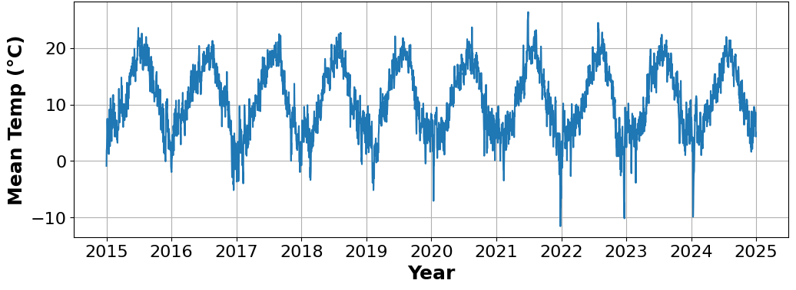
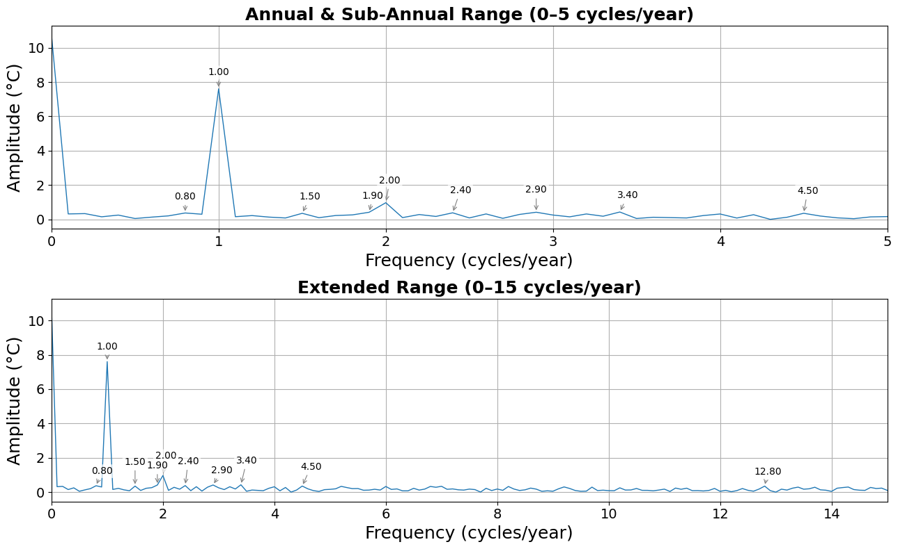
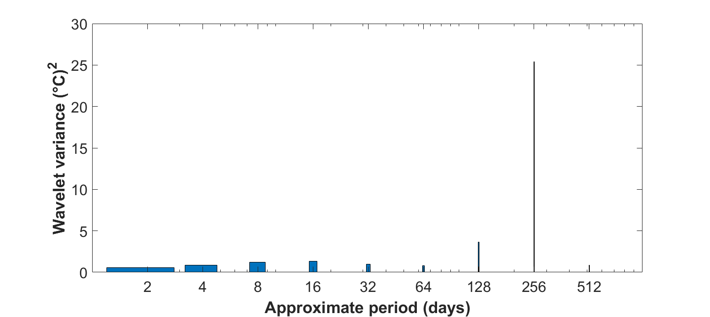
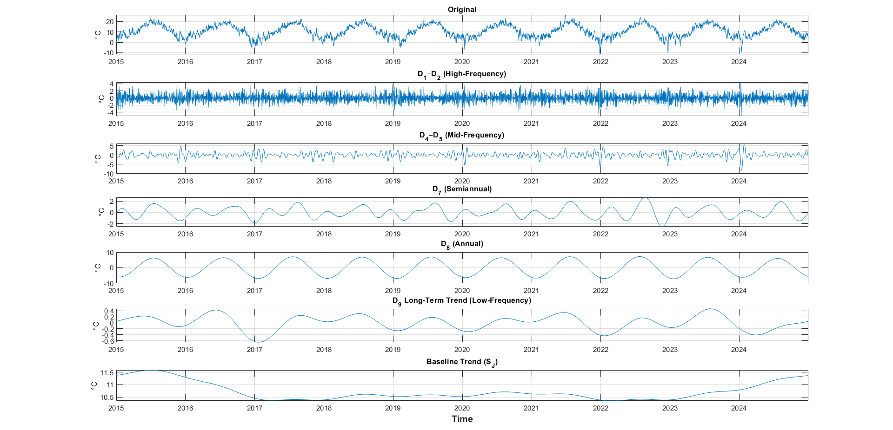

# Analyzing Temperature Trends Using Fourier and Wavelet Transformation Methods
This repository contains code, data, and figures for a climate time-series analysis project comparing **Discrete Fourier Transform (DFT)** and **Maximal Overlap Discrete Wavelet Transform (MODWT)** methods on daily mean temperature data from Vancouver, Canada (2015–2024).

The project explores how frequency-domain and time-frequency methods can be used to detect dominant cycles, characterize variability across scales, and compare complementary signal processing approaches for climate data.

---

## Project Overview
Climate time series are often highly seasonal and nonstationary, making it difficult to isolate meaningful patterns using only standard visual inspection. This project applies two transform-based methods to daily mean temperature data:

- **Discrete Fourier Transform (DFT)** for identifying dominant global periodicities
- **Maximal Overlap Discrete Wavelet Transform (MODWT)** for identifying time-localized structure across multiple scales

The goal was to evaluate how these two methods differ and how they can be used together to better understand temperature variability.

---

## Dataset
The dataset consists of **3,653 daily observations** of mean temperature for **Vancouver, Canada** from **2015 to 2024**.

Source:
Environment and Climate Change Canada (ECCC)  
MSC Datamart historical climate data

https://www.canada.ca/en/environment-climate-change/services/weather-general-tools-resources/weather-tools-specialized-data.html

**Preprocessing steps included:**
- Cleaning the raw weather data
- Checking for missing values
- Linearly interpolating 47 missing mean temperature observations
- Constructing a complete daily time series for analysis

The resulting dataset forms a complete daily time series:

  
   
  <em>Vancouver Mean Daily Temperatures 2015–2024</em>

---

## Methods

### Discrete Fourier Transform (DFT)
The DFT was used to convert the daily temperature signal into the frequency domain in order to:
- Identify dominant cycles
- Quantify annual and semi-annual periodicities
- Reconstruct the signal using dominant spectral components

### Maximal Overlap Discrete Wavelet Transform (MODWT)
The MODWT using a Daubechies 4 (db4) wavelet was used to decompose the temperature signal across multiple time scales in order to:
- Examine localized variability in time
- Perform multiresolution analysis
- Reconstruct the signal using dominant wavelet scales

---

## Repository Structure
- **notebooks/**
  - **01_Data_Preprocessing.ipynb** – data cleaning and preparation
  - **02_DFT_Analysis.ipynb** – Fourier transform analysis in Python
  - **03_MODWT_Analysis.m** – MODWT and multiresolution analysis in MATLAB

- **data/** – cleaned climate dataset

- **figures/** – key project visualizations

---

## Results
The analysis showed that both methods captured strong seasonal structures in the temperature record, but they emphasized different aspects of the signal. 

### DFT Findings
- The dominant spectral peak occurred at **1 cycle per year**, corresponding to the annual seasonal cycle
- A second strong peak at **2 cycles per year** captured the semi-annual component
- Reconstructing the signal using the top five Fourier coefficients preserved the main seasonal pattern with **MSE = 6.27 °C²**

  
   
  <em>DFT Single-Sided Amplitude Spectra</em>

### MODWT Findings
- The dominant MODWT scale corresponded to the **annual cycle**
- The next strongest scale captured **semi-annual variability**
- Multiresolution analysis revealed localized short-term and medium-term fluctuations not visible in the DFT
- Reconstruction using the top three dominant scales achieved an **MSE = 3.85 °C²**

  
   
  <em>MODWT Global Wavelet Power Plot (db4 wavelet)</em>

  
   
  <em>MODWT Multiresolution Analysis Components (2015–2024)</em>

### Comparison
- **DFT** provided a strong global summary of the dominant periodic structure
- **MODWT** provided a clearer time-localized view of how variability changed across scales
- Together, the two methods offered complementary insights into Vancouver temperature dynamics

---

## Key Takeaways
- Fourier methods effectively identify **dominant global cycles**
- Wavelet methods capture **localized variability across time scales**
- Combining both provides a more complete understanding of the temperature signal

---

## Tools and Libraries
- Python
- MATLAB
- NumPy
- Pandas
- Matplotlib
- MATLAB Wavelet Toolbox  (`modwt`, `modwtmra`)
